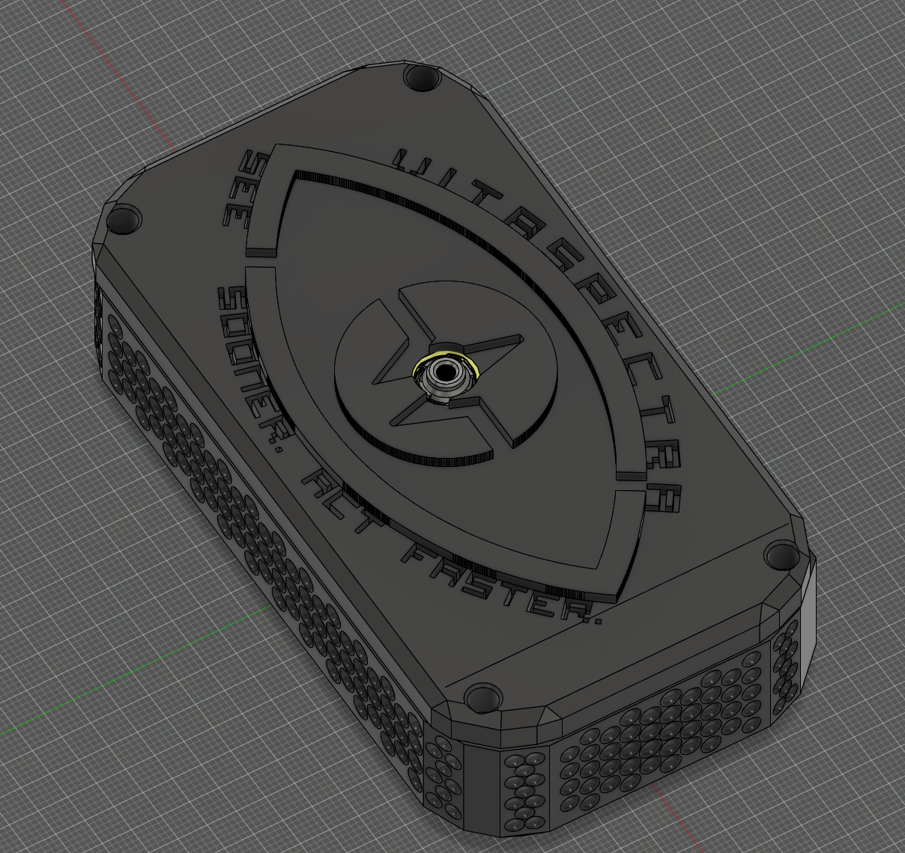
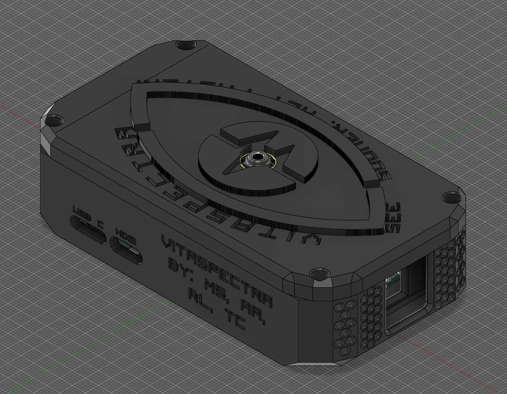
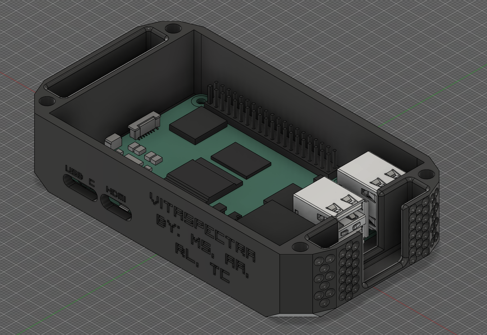
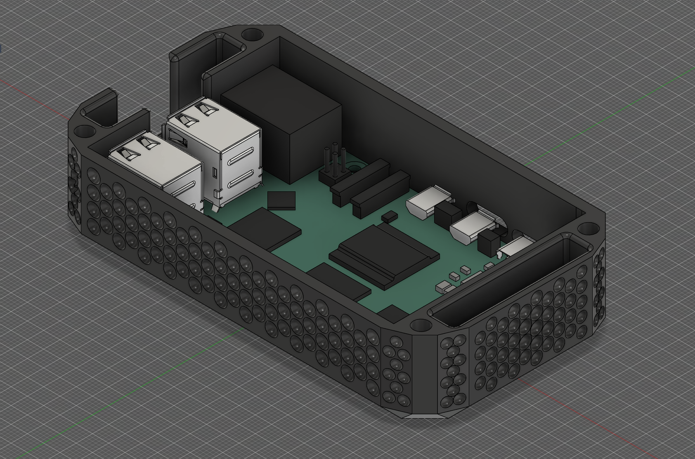

<div align="center">

# VitaSpectra

<p align="center">In emergency situations, first responders need useful patient information as quickly as possible, but collecting vital signs can take time and often requires physical contact, extra equipment, and divided attention. We wanted to explore what would happen if some of that information could be captured passively through a camera and displayed directly in a responder’s field of view.</p>

<p align="center"><a href="https://devpost.com/software/tempname-sfk4wn">Devpost</a></p>


[](https://github.com/QuantumCoder325/HackTheHill3/stargazers) [](https://github.com/QuantumCoder325/HackTheHill3/network) [](https://github.com/QuantumCoder325/HackTheHill3/issues) [](https://github.com/QuantumCoder325/HackTheHill3/watchers) [](https://opensource.org/licenses/MIT)

    

[🐛 Report Bug](https://github.com/QuantumCoder325/vitaspectra/issues) · [✨ Request Feature](https://github.com/QuantumCoder325/vitaspectra/issues)

</div>

---

## 📋 Table of Contents

- [📸 Screenshots](#screenshots)
- [⚙️ Prerequisites](#prerequisites)
- [🚀 Installation](#installation)
- [💻 Usage](#usage)
- [✨ Features](#features)
- [📄 License](#license)
- [👤 Contact](#contact)
- [🙏 Acknowledgements](#acknowledgements)

## 📸 Screenshots





## ⚙️ Hardware Used

- Raspberry Pi 5, 8GB
- Raspberry Pi Camera Module 3, standard 75° FOV
- Display (Rayneo Air 4 Pro's were used for the Demo)

## 💻 Usage

```bash
rpicam-vid -t 0 --inline --framerate 30 --width 640 --height 480 --codec yuv420 -o - | \
ffmpeg -fflags nobuffer -flags low_delay -f rawvideo -pix_fmt yuv420p -s 640x480 -r 30 -i - -f v4l2 /dev/video10

Seprately:
npm install
npm start
```

## ✨ Features

- ✅ Breathing rate monitoring
- ✅ Breathing waveform monitoring
- ✅ Pulse rate trace

## 📄 License

Distributed under the MIT License. See `LICENSE` for more information.

## 👤 Contact

**Trevor,  Aashir, Muhammad, Rayyan**
- GitHub: [@QuantumCoder325](https://github.com/QuantumCoder325)
- Project: [https://github.com/QuantumCoder325/vitaspectra](https://github.com/QuantumCoder325/vitaspectra)

## 🙏 Acknowledgements

- Hack The Hill 3 (For Hosting)
- MLH (For Hardware Support)

---

<div align="center">Made with ❤️ by Trevor,  Aashir, Muhammad, Rayyan</div>
